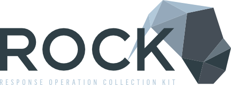

 

  <strong><a href="https://rocknsm.gitbooks.io/rocknsm-guide/content/">Documentation</a> | <a href="https://download.rocknsm.io/">Download<a/></strong>

ROCK is a collections platform, in the spirit of Network Security Monitoring by contributors from all over industry and the public sector. It's primary focus is to provide a robust, scalable sensor platform for both enduring security monitoring and incident response missions. The platform consists of 3 core capabilities:

* Passive data acquisition via AF_PACKET, feeding systems for metadata (Bro), signature detection (Suricata), and full packet capture (Stenographer).
* A messaging layer (Kafka and Logstash) that provides flexibility in scaling the platform to meet operational needs, as well as providing some degree of data reliability in transit.
* Reliable data storage and indexing (Elasticsearch) to support rapid retrieval and analysis (Kibana) of the data.

## Features

* Full Packet Capture via Google Stenographer and Docket.
* Protocol Analysis and Metadata via Bro.
* Signature Based Alerting via Suricata.
* Recursive File Scanning via FSF.
* Message Queuing and Distribution via Apache Kafka.
* Message Transport via Logstash.
* Data Storage, Indexing, and Search via Elasticsearch.
* Data UI and Visualization via Kibana.
* Security - The system is developed and tested to run with SELinux enabled.

### Installation and Usage

Please reference our [documentation](https://rocknsm.gitbooks.io/rocknsm-guide/content/) for all ROCK details to include:

- installation
- configuration
- deployment
- troubleshooting

## Thanks
This architecture is made possible by the efforts of an ever-growing list of amazing people. Look around our Github to see the whole list.

<!--  -->
